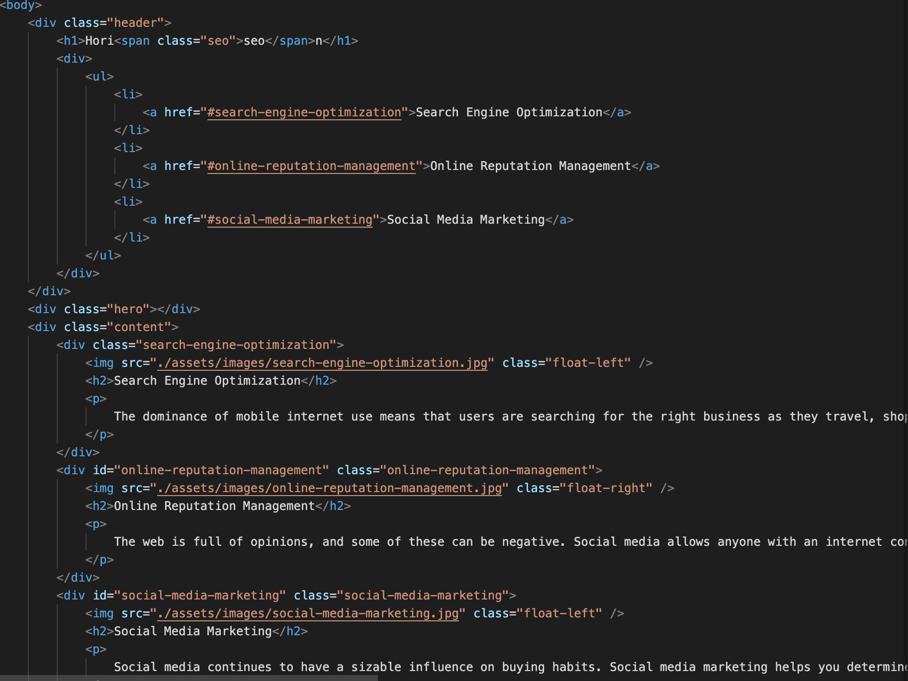
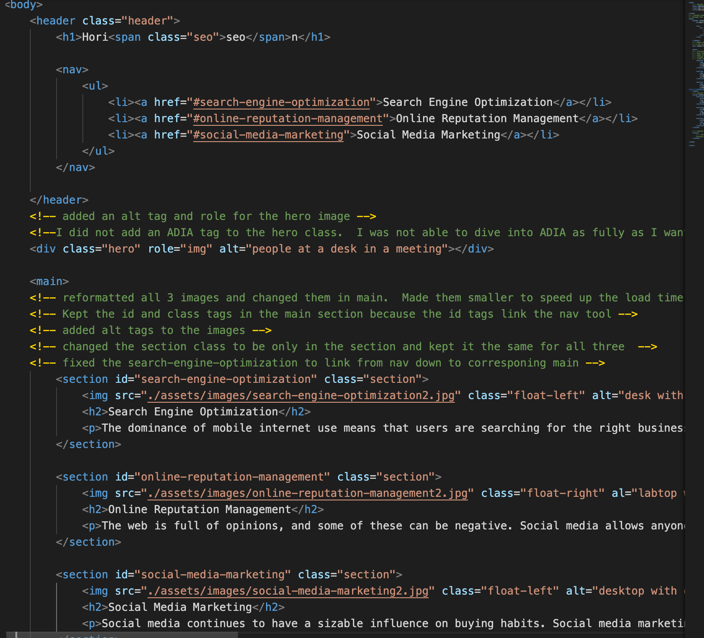
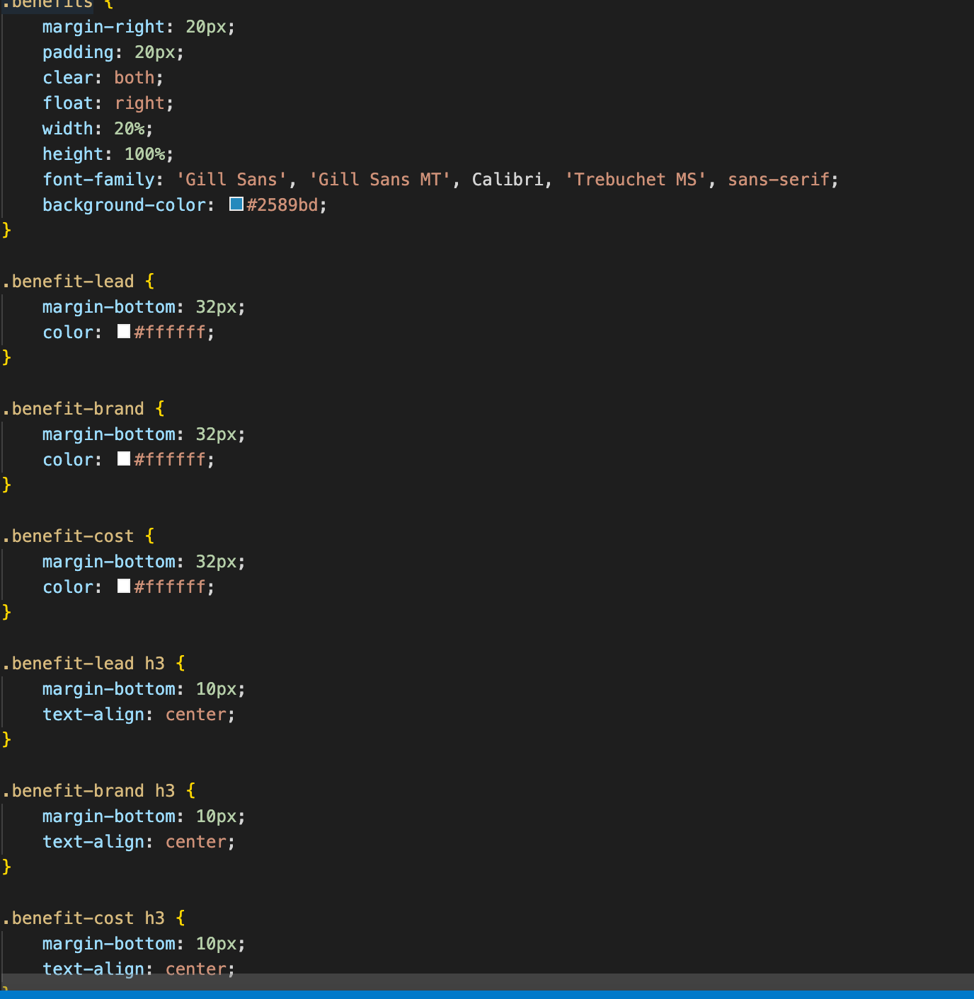
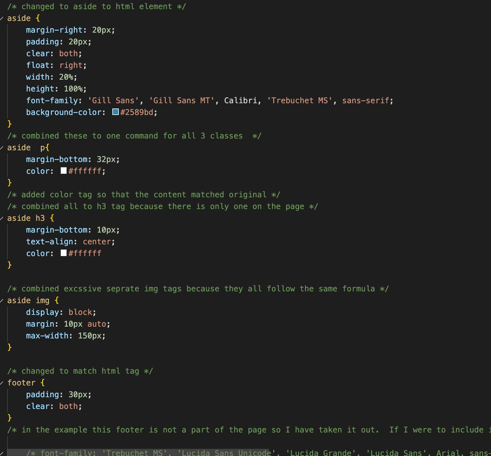

# Horiseon-Refactor

## Description  

Marketing company **Horiseon** has asked that we streamline the user experience on thier website without changing the site's design.  Some of the content is causing slower load times.  Not all the features respond the way the user should expect based on the current functions. Horiseon requested additions to the content follow accessibility standards.  We have cleaned up many of these issues, and the site is more responsive. It is important for this company to present as up to date and user friendly as possible.  The company goal is to help market other businesses with a strong online presence.  If the target market has any perceived discomfort while using this site it could possibly turn them away.  The user is someone searching for a leader in the online community.  

## Html Changes  
* Changed Div tags to follow a logical semantic flow
* Added alt tags to images to increase accessibility 
* Changed Title to be more descriptive of the content 
* reformatted the code to be easier to follow 
* fixed the link that was not operational 
* resized the images and swiched them out to speed page load time
* added comments about what changes were made 
* eliminated any redundant information 

### Original HTMl

### New HTML

## CSS Changes 
* moved tags aroung to match hmlt workflow
* resized the hero image to help page load time
* added the corresponding changes to html semanic tags in css
* removed unnecessary id and class tag
* removed redundant naming tags
* removed footer to match client image 
* combined elements that were in the same family and had no differences 

### Original CSS

### New CSS 

## User Notes
There is still work to be done on this code.  The site needs screen size paramaters to fully round out the viewers experience.  This task proved to be too big for me at this stage.  I learrned mostly how to relate html and css together. I am proud to have increased the load time therefore improving the users interaction.  
